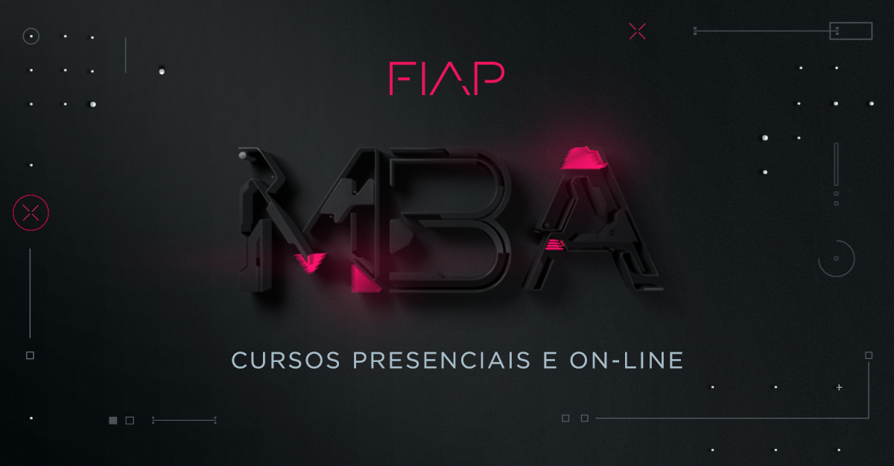

# Aplicações para os curso de pós-graduação da FIAP

 - [MBA em Arquitetura de Soluções (ASO)](https://github.com/josecastillolema/fiap/tree/master/aso)
   * Arquitetura de *Storage* / *DataCenter* / Virtualização e *Microcontainers*
 - [MBA em *Big Data / Data Science* (BDT)](https://github.com/josecastillolema/fiap/tree/master/bdt)
   * Internet das Coisas
 - [MBA em *Blockchain Development & Technologies* (BLC)](https://github.com/josecastillolema/fiap/tree/master/blc)
   * *DevOps & Cloud Oriented Architecture*
 - [MBA em *Cloud Computing* (CLD)](https://github.com/josecastillolema/fiap/tree/master/cld)
   * Implementação de *Cloud*
   * Implementação OpenStack
 - [MBA em *Artificial Intelligence & Machine Learning* (IA)](https://github.com/josecastillolema/fiap/tree/master/ia)
   * Princípios de Robótica e IoT
 - [MBA em *Mobile Development* (MOB)](https://github.com/josecastillolema/fiap/tree/master/mob)
   * *DevOps & Cloud Oriented Architecture*
   * Segurança para Aplicações Móveis para Internet das Coisas e *Cloud Computing*
 - [MBA em Arquitetura e Desenvolvimento na Plataforma .NET (NET)](https://github.com/josecastillolema/fiap/tree/master/net)
   * Arquitetura *Windows Azure Services*
 - [MBA em *Full Stack Developer* - *Microservices*, *Cloud* e IoT (SCJ)](https://github.com/josecastillolema/fiap/tree/master/scj)
   * Arquitetura e Desenvolvimento Java com IoT
   * Arquitetura e Desenvolvimento Java de Alta Disponibilidade para *Cloud Computing*
   * Arquitetura e Infraestrutura de *Cloud Computing* e Internet das Coisas
   * *Cloud Development*

Cada projeto se refere a aulas e/ou roteiros executados em sala de aula.
Fique a vontade para evoluir estes exemplos, desde que sejam válidos, aceitarei *pull requests* :smile:.

Para saber mais sobre os cursos, acesse o site de MBA da FIAP em https://www.fiap.com.br/mba/.

