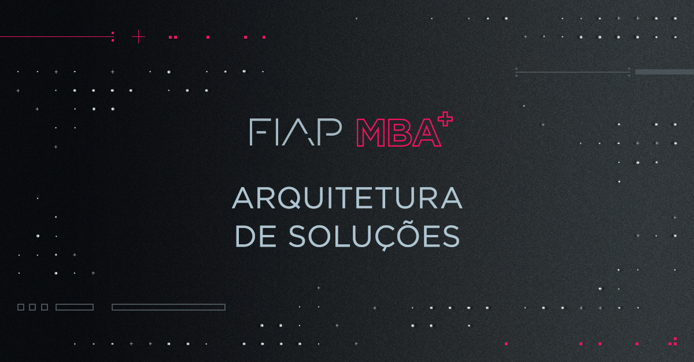

# MBA em Arquitetura de Soluções (ASO)

## [Arquitetura de *Storage* / *DataCenter* / Virtualização e Microcontainers](https://github.com/josecastillolema/fiap/tree/master/aso/microservices)

## Arquitetura em *MultiCloud* (AWS / GCP / Azure / IBM Cloud)

Para saber mais sobre o curso, acesse o site do MBA em Arquitetura de Solucoes da FIAP em https://www.fiap.com.br/mba/mba-em-arquitetura-de-solucoes/.

