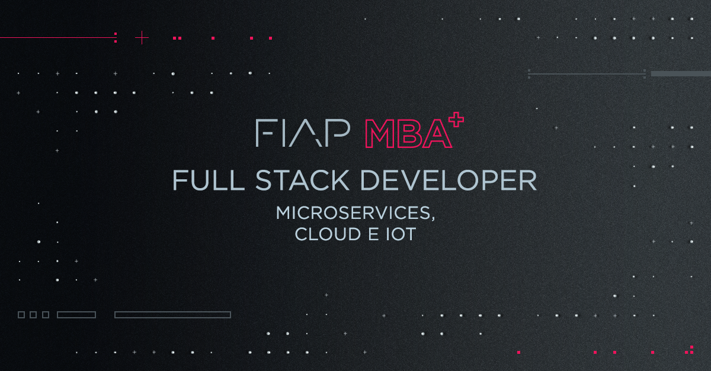

# MBA em *Full Stack Developer* - *Microservices*, *Cloud* e IoT (SCJ)

## Arquitetura e Desenvolvimento Java com IoT
## Arquitetura e Desenvolvimento Java de Alta Disponibilidade para *Cloud Computing*
## Arquitetura e Infraestrutura de *Cloud Computing* e Internet das Coisas
## *Cloud Development*

Cada projeto se refere a aulas e/ou roteiros executados em sala de aula.
Fique a vontade para evoluir estes exemplos, desde que sejam válidos, aceitarei *pull requests* :smile:.

Para saber mais sobre o curso, acesse o site de MBA da FIAP em https://www.fiap.com.br/mba/mba-em-full-stack-developer-microservices-cloud-e-iot/.

