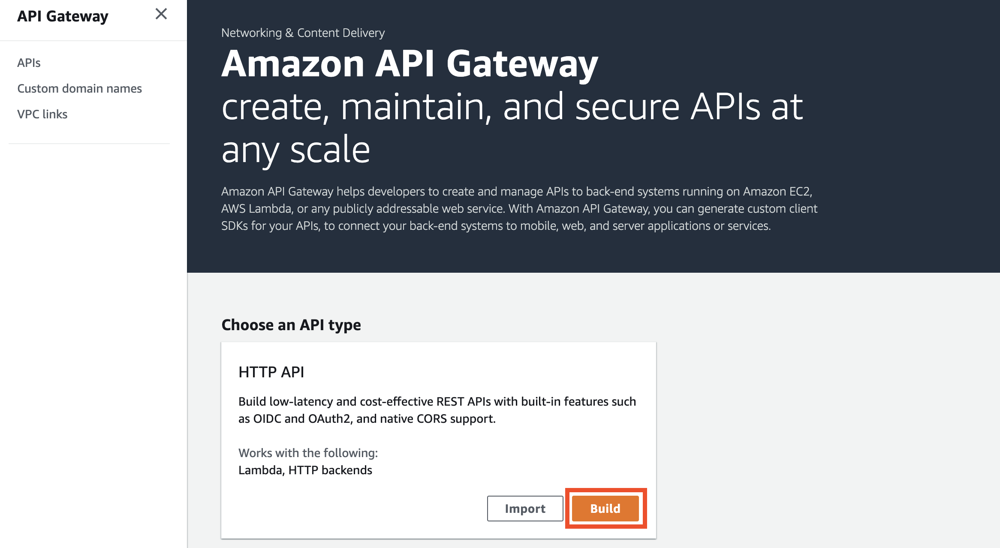

# Lab 10 - Amazon API Gateway

Em este lab sobre **API Gateway** aprenderemos alguns conceitos do API gateway da plataforma da AWS:
 - Configuração de rotas
 - Throttling (limitação de requisições) 
 - Monitoramento
 
## Pre-reqs

- Dois URLs accessíveis. Por exemplo, dois apps no Beanstalk:
    * http://springboot-env.eba-7znjbf9p.us-eats-1.elasticbeanstalk.com
        
    * http://springboot-env-1.eba-7zbhbf9p.us-east-1.elasticbeanstalk.com
        

 ## Configuração do serviço
 
1. Acessar o serviço **API Gateway**:
   

2. Criar uma nova API HTTP:
   

3. Configurar o nome da API e as integrações, apontando para as duas URLs dos prereqs usando o método `GET`:
   
   
4. Configurar as rotas, `/v1` apontando para uma URL e `/v2` apontando para a outra:
   

5. Sem modificações na configuração padrão de *stages*:
   
   
6. Revisar as configurações e confirmar a criação:
   
   
7. Aguardar a criação da API:
   

8. 
