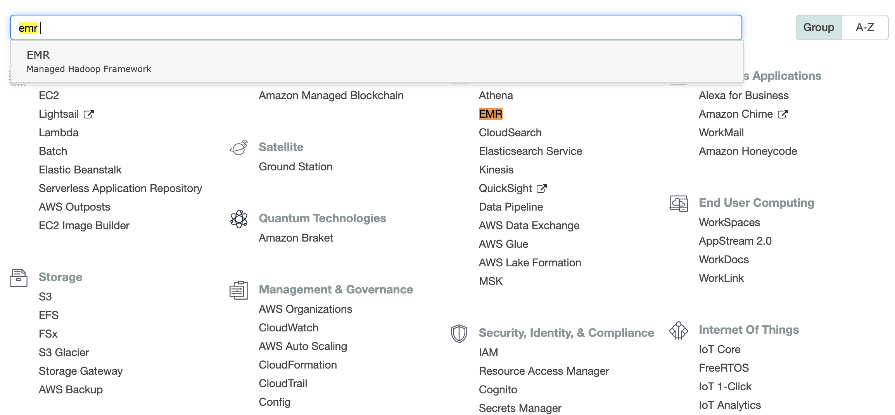
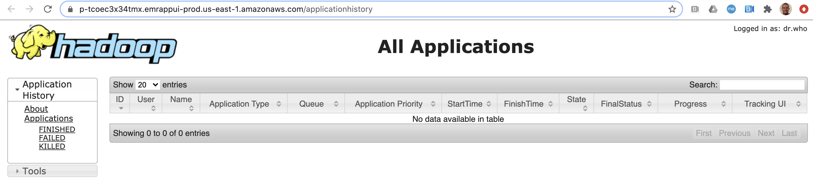
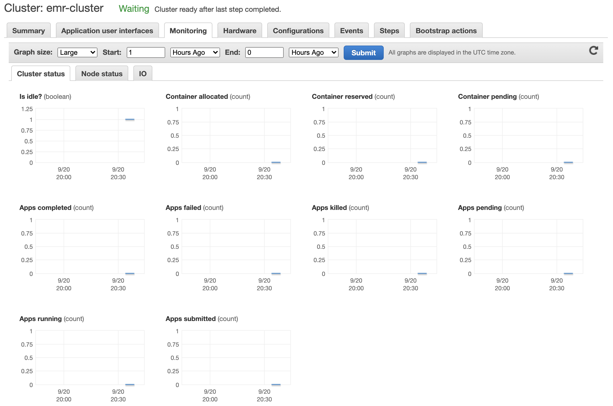

# Lab 12 - Elastic Map Reduce

Em este lab sobre **EMR** aprenderemos alguns conceitos da plataforma de Big Data as a Service da AWS:
 - Criação de cluster
 - Acesso via WEB e SSH/CLI
 - Monitoramento

 ## Configuração do serviço
 
1. Acessar o serviço **EMR**:
   
   
2. Iniciar a criação do cluster:
   
   
3. Escolher um nome para o cluster, um bucket do S3 para armacenar os logs, versão do EMR e conjunto de aplicações solicitado:
   

4. Escolha de flavor, número de instâncias e chave SSH para acessar o cluster. Quem tiver usando a conta do AWS Educate, lembre-se que só os seguintes flavors estão disponíveis: `t2.small`, `t2.micro`, `t2.nano`, `m4.large`, `c4.large`, `c5.large`, `m5.large`, `t2.medium`, `m4.xlarge`, `t2.nano`, `c4.xlarge`, `c5.xlarge`, `t2.2xlarge`, `m5.2xlarge`, `t2.large`, `t2.xlarge` e `m5.xlarge`
   

5. Aguardar a criação do cluster:
   

   
   
6. Acessar a interface web do YARN timeline server:
   

7. Acessar a interface web do Tez:
   
   
8. Acessar via SSH no master node. É necessário liberar a porta 22 no `security group` associado às instâncias criadas no EC2:
    ```
    % ssh -i fiap.pem hadoop@ec2-3-81-126-78.compute-1.amazonaws.com

    The authenticity of host 'ec2-3-81-126-78.compute-1.amazonaws.com (3.81.126.78)' can't be established.
    ECDSA key fingerprint is SHA256:Bavwz+doMGvtdOwhJM7+IGCrURgDCL/a/6ISfjROYLM.
    Are you sure you want to continue connecting (yes/no/[fingerprint])? YES
    Warning: Permanently added 'ec2-3-81-126-78.compute-1.amazonaws.com,3.81.126.78' (ECDSA) to the list of known hosts.
    Last login: Sun Sep 20 20:36:00 2020

           __|  __|_  )
           _|  (     /   Amazon Linux 2 AMI
          ___|\___|___|

    https://aws.amazon.com/amazon-linux-2/
    33 package(s) needed for security, out of 90 available
    Run "sudo yum update" to apply all updates.

    EEEEEEEEEEEEEEEEEEEE MMMMMMMM           MMMMMMMM RRRRRRRRRRRRRRR    
    E::::::::::::::::::E M:::::::M         M:::::::M R::::::::::::::R   
    EE:::::EEEEEEEEE:::E M::::::::M       M::::::::M R:::::RRRRRR:::::R 
      E::::E       EEEEE M:::::::::M     M:::::::::M RR::::R      R::::R
      E::::E             M::::::M:::M   M:::M::::::M   R:::R      R::::R
      E:::::EEEEEEEEEE   M:::::M M:::M M:::M M:::::M   R:::RRRRRR:::::R 
      E::::::::::::::E   M:::::M  M:::M:::M  M:::::M   R:::::::::::RR   
      E:::::EEEEEEEEEE   M:::::M   M:::::M   M:::::M   R:::RRRRRR::::R  
      E::::E             M:::::M    M:::M    M:::::M   R:::R      R::::R
      E::::E       EEEEE M:::::M     MMM     M:::::M   R:::R      R::::R
    EE:::::EEEEEEEE::::E M:::::M             M:::::M   R:::R      R::::R
    E::::::::::::::::::E M:::::M             M:::::M RR::::R      R::::R
    EEEEEEEEEEEEEEEEEEEE MMMMMMM             MMMMMMM RRRRRRR      RRRRRR

    [hadoop@ip-172-31-42-29 ~]$ hive

    Logging initialized using configuration in file:/etc/hive/conf.dist/hive-log4j2.properties Async: false
    hive> show databases;
    OK
    default
    Time taken: 0.086 seconds, Fetched: 1 row(s)
    hive> 

    ```
    
 9. Conferir a aba de monitoramento:
   
