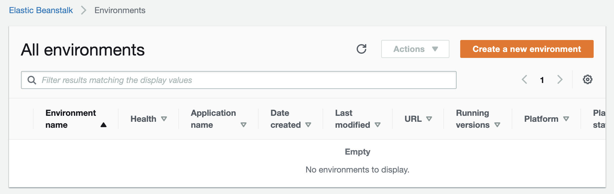
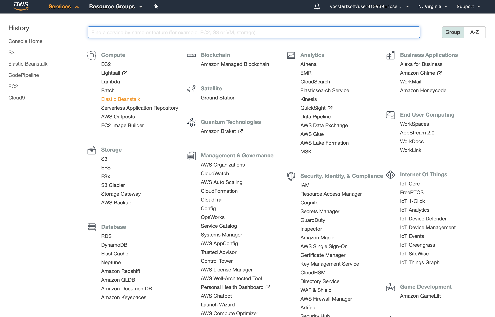

# Lab 6 - AWS Elastic Beanstalk

Em este lab sobre **Elastic Beanstalk (EB)** aprenderemos alguns conceitos importantes da camada de plataforma da AWS:
 - *Deploy* de aplicações
 - Plataformas/entornos de execução disponíveis
 - *Logging*
 - Monitoramento
 
## Pre-reqs

 - `git`
 - `python3`
 - `pip3`

Se não tiver os pre-reqs na máquina local pular para o [deploy em uma VM no EC2](#deploy-em-uma-vm-no-ec2).

## *Deploy* local

1. Clonar o repositório:
    ```
    git clone https://github.com/josecastillolema/fiap
    ```
    
2. Navegar ate o diretorio `fiap/scj/cloud/lab06-paas-eb`. O diretorio contem os [seguintes arquivos](lab06-paas-eb):
    - [**`application.py`**](lab06-paas-eb/application.py): Um serviço web escrito em Python que usa a biblioteca [Flask](https://flask.palletsprojects.com/en/1.1.x/).
    - [**`requirements.txt`**](lab06-paas-eb/requirements.txt): As dependências da aplicação. Podem ser instaladas usando `pip`, o gestor de dependências do Python.
 
3. Instalar as dependências:
    ```
    pip3 install -r requirements.txt
    ```
    
4. Executar a aplicação:
    ```
    $ python3 application.py
     * Serving Flask app "application" (lazy loading)
     * Environment: production
       WARNING: Do not use the development server in a production environment.
       Use a production WSGI server instead.
     * Debug mode: off
     * Running on http://127.0.0.1:5000/ (Press CTRL+C to quit)
    ```

5. Testar o acesso local:
   
   
## *Deploy* em uma VM no EC2

Se tiver feito o deploy local pode pular esta seção.

1. Criar uma VM com a imagem `Ubuntu 18.04`

2. Logar na VM

3. Atualizar os repositorios:
    ```
    $ sudo apt update
    ```
    
4. Instalar o pip3 (gestor de pacotes do python3):
    ```
    $ sudo apt install python3-pip -y
    ```

5. Clonar o repositório:
    ```
    git clone https://github.com/josecastillolema/fiap
    ```
    
6. Navegar ate o diretorio `fiap/scj/cloud/lab06-paas-eb`. O diretorio contem os [seguintes arquivos](lab06-paas-eb):
    - [**`application.py`**](lab06-paas-eb/application.py): Um serviço web escrito em Python que usa a biblioteca [Flask](https://flask.palletsprojects.com/en/1.1.x/).
    - [**`requirements.txt`**](lab06-paas-eb/requirements.txt): As dependências da aplicação. Podem ser instaladas usando `pip`, o gestor de dependências do Python.
 
7. Instalar as dependências:
    ```
    pip3 install -r requirements.txt
    ```
    
8. Executar a aplicação:
    ```
    $ python3 application.py
     * Serving Flask app "application" (lazy loading)
     * Environment: production
       WARNING: Do not use the development server in a production environment.
       Use a production WSGI server instead.
     * Debug mode: off
     * Running on http://127.0.0.1:5000/ (Press CTRL+C to quit)
    ```

9. Testar o acesso local:
    ```
    $ curl localhost:5000
    <h1>Hola FIAP!</h1>
    ```

5. Testar o acesso remoto pela IP pública da VM (lembrando que é necessária a liberacão da porta 5000 no *security group* da VM):

   

## *Deploy* na AWS
 
1. Acessar o serviço **Elastic Beanstalk**:
   

2. Criar um novo *environment*:
   

3. A aplicação é um serviço web:
   
   
4. Configurar o nome da apliação:
   

5. Escolher o entorno de execução:
   
   
6. Fazer o *upload* da aplicação. O arquivo comprimido deve conter os [seguintes arquivos](lab06-paas-eb):
 - [**`application.py`**](lab06-paas-eb/application.py): Um serviço web escrito em Python que usa a biblioteca [Flask](https://flask.palletsprojects.com/en/1.1.x/).
 - [**`requirements.txt`**](lab06-paas-eb/requirements.txt): As dependências da aplicação. Podem ser instaladas usando `pip`, o gestor de dependências do Python.
 
   

7. Após uns minutos, conferir o estado da aplicação:
   

8. Accessar a URL da aplicação:
   

## *Logging* e monitoramento

9. Se for necessário fazer *troubleshooting* da aplicação, fazer *download* dos logs:
   

10. Para monitorar a aplicação:
   

