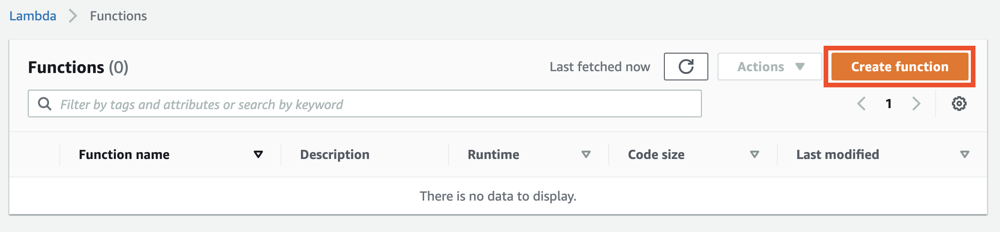
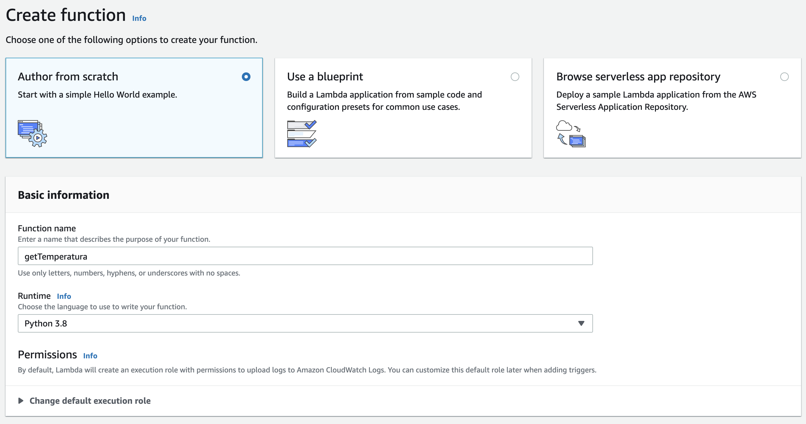
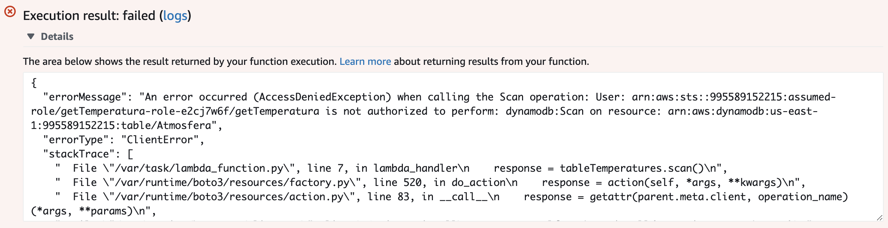
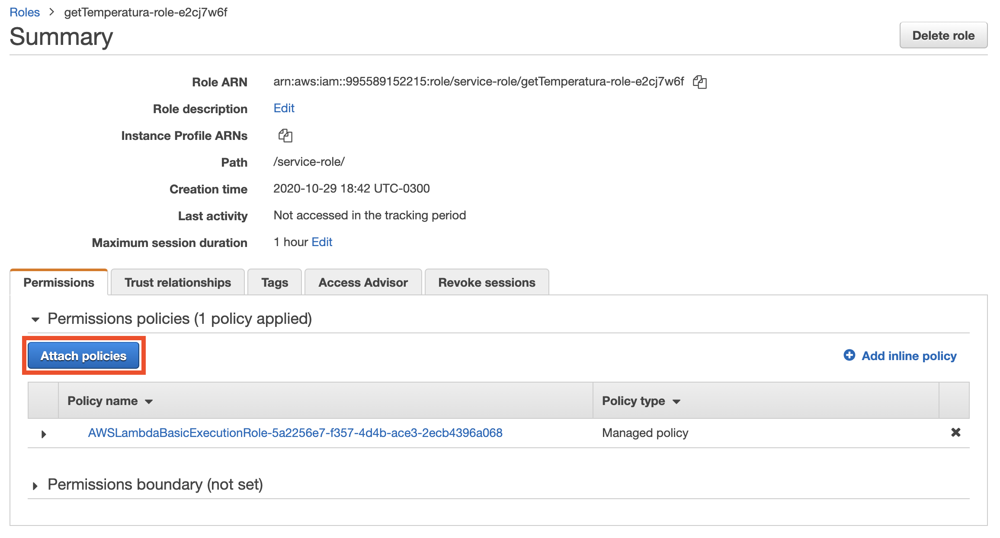
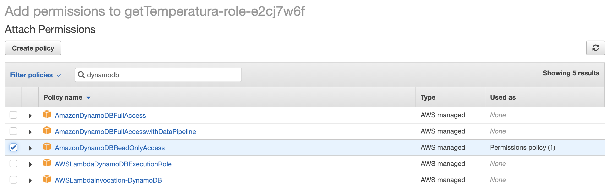
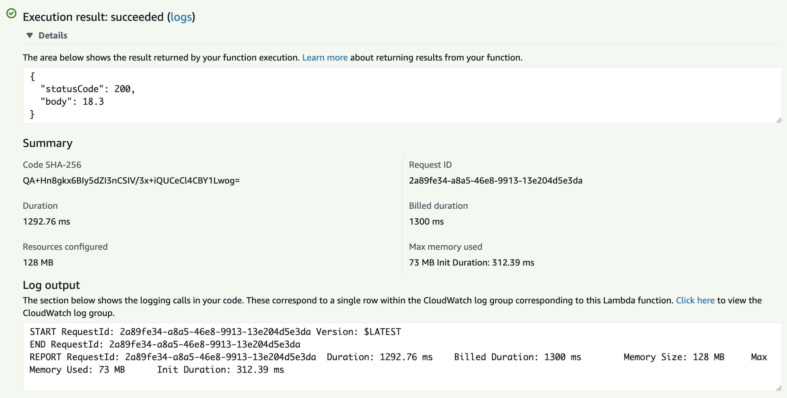
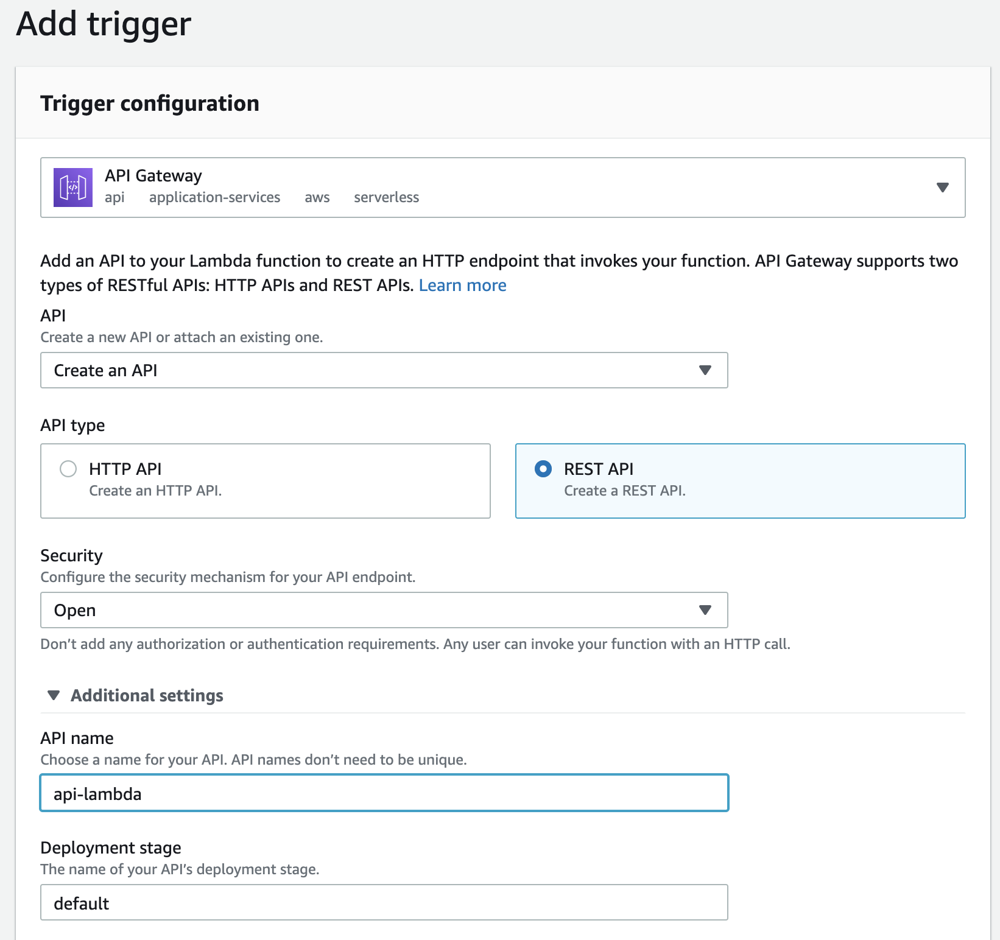
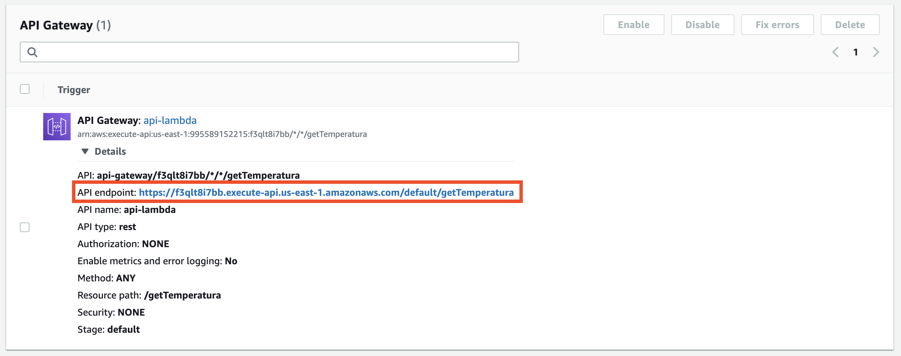
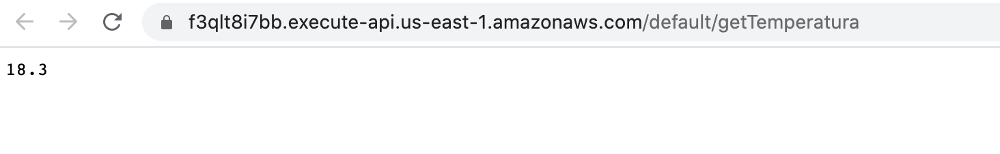
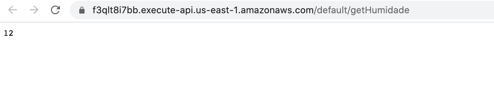

# Lab 13 - Amazon Lambda

Em este lab sobre [**Lambda**](https://aws.amazon.com/pt/lambda/) aprenderemos alguns conceitos do modulo de Function as a Service (FaaS) / *serverless* da plataforma da AWS:
 - Criação de funções Lambda
 - Teste de funções 
 - Criação de triggers (via API Gateway)
 
## Pre-reqs

- A seguinte tabela, com nome `Atmosfera` criada no DynamoDB:
    * sala: *primary key*, string
    * temperatura: number
    * humidade: number
    

 ## Configuração do serviço

1. Acessar o serviço **Lambda**:
    

2. Criar uma nova função:
    
   
3. Criar uma primera função `getTemperatura` com Python como *runtime*:
    

4. Configurar o seguinte código para a função:
    ```python
    import json
    import boto3
    def lambda_handler(event, context):
       dynamodb = boto3.resource('dynamodb')
       tableTemperatures = dynamodb.Table('Atmosfera')
       response = tableTemperatures.scan()
       return {
          'statusCode': 200,
          'body': response['Items'][0]['temperatura']
       }
    ```
    O código lee o valor `temperatura` da tabela `Atmosfera` do DynamoDB.
    
    
5. Fazer *deploy* do código:
    

6. Vamos testar o código:
    

7. Criamos um evento de testes. A entrada do evento (o arquivo `json`) é indeferente em este caso específico, pois a API não está lendo entrada:
    

 8. Executar o evento de testes recém criado `testeGetTemperatura`:
    

 9. O teste deve falhar, pois a função não tem permissão para acessar o DynamoDB:
    

 10. No IAM, procurar o *role* da função:
    

 11. Adicionar uma nova *policy*: 
    

 12. A policy `AmazonDynamoDBReadOnlyAccess` vai dar acesso de leitura ao DynamoDB:
    

 13. Estado final da *role*:
    

 14. Ejecutar de novo o teste, agora deberia funcionar:
    

 15. Agora vamos configurar um *trigger* para a função:
    

 16. O *trigger* será um *endpoint* em uma nova API do API Gateway chamada `api-lambda`:
    

 17. Conferir que o *trigger* foi criado e asociado à função:
    

 18. Nos detalhes do *trigger* podemos ver a URL do *endpoint*:
    

 19. Testamos o *endpoint* (se aparecer a mensagem `{"message":"Missing Authentication Token"}` aguardar um minuto e repetir o teste):
    

 ## Configuração do segundo *endpoint* usando a mesma API

20. Repetir os pasos **2** e **3** para criar uma segunda função `getHumidade` com Python como *runtime*:
    
 
21. Configurar o seguinte código para a função e fazer *deploy* do mesmo:
    ```python
    import json
    import boto3
    def lambda_handler(event, context):
       dynamodb = boto3.resource('dynamodb')
       tableTemperatures = dynamodb.Table('Atmosfera')
       response = tableTemperatures.scan()
       return {
          'statusCode': 200,
          'body': response['Items'][0]['humidade']
       }
    ```

    O código lee o valor `humidade` da tabela `Atmosfera` do DynamoDB.

22. Configurar as devidas permissões para a role da nova função no IAM, como mostrado nos passos **10**, **11**, **12** e **13**:
    

23. Testar a nova função como mostrado nos passos **7** e **8**:
    

23. Criar um *trigger* para a função usando *a mesma API* que no passo **16**:
    
    
24. Obter o endpoint nos detalhes do trigger:
    

25. Conferir o novo endpoint da API (se aparecer a mensagem `{"message":"Missing Authentication Token"}` aguardar um minuto e repetir o teste):
    
