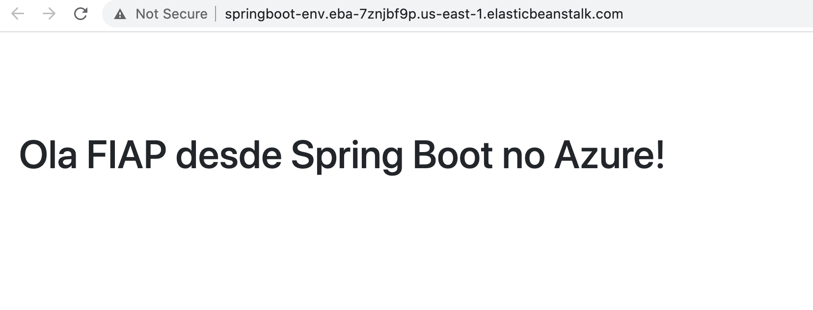

# Lab 13 - Amazon Lambda

Em este lab sobre **Lambda** aprenderemos alguns conceitos do modulo de Function as a Service (FaaS) / *serverless* da plataforma da AWS:
 - Configuração de rotas
 - *Throttling* (limitação do número de requisições por segundo) 
 - Monitoramento
 
## Pre-reqs

- Dois URLs accessíveis. Por exemplo, dois apps no Beanstalk:
    * http://springboot-env.eba-7znjbf9p.us-eats-1.elasticbeanstalk.com
        
    * http://springboot-env-1.eba-7zbhbf9p.us-east-1.elasticbeanstalk.com
        

 ## Configuração do serviço
